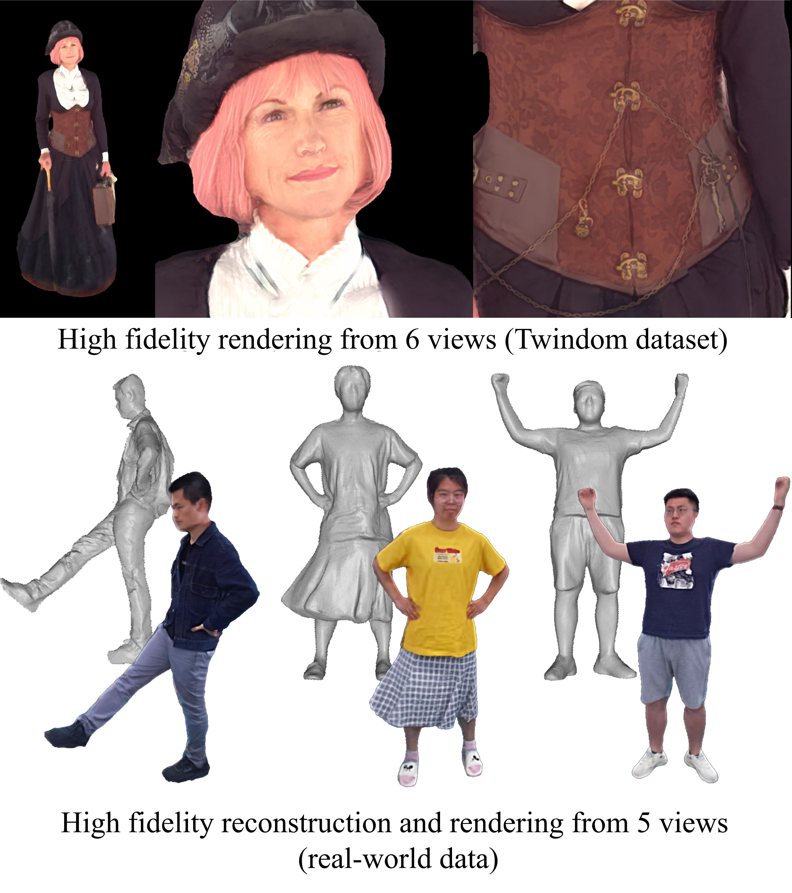

# [DoubleField: Bridging the Neural Surface and Radiance Fields for High-fidelity Human Reconstruction and Rendering (CVPR 2022)](http://www.liuyebin.com/dbfield/dbfield.html)
Ruizhi Shao, [Hongwen Zhang](), He Zhang, Mingjia Chen, Yanpei Cao, [Tao Yu](http://ytrock.com/), [Yebin Liu](http://www.liuyebin.com/).

[](https://arxiv.org/)

This repository contains the official pytorch implementation of ”*DoubleField: Bridging the Neural Surface and Radiance Fields for High-fidelity Human Reconstruction and Rendering*“.



## Citation
```
@inproceedings{shao2022doublefield,
author = {Shao, Ruizhi and Zhang, Hongwen and Zhang, He and Chen, Mingjia and Cao, Yanpei and Yu, Tao and Liu, Yebin},
title = {DoubleField: Bridging the Neural Surface and Radiance Fields for High-fidelity Human Reconstruction and Rendering},
booktitle = {CVPR},
year = {2022}
}
```
